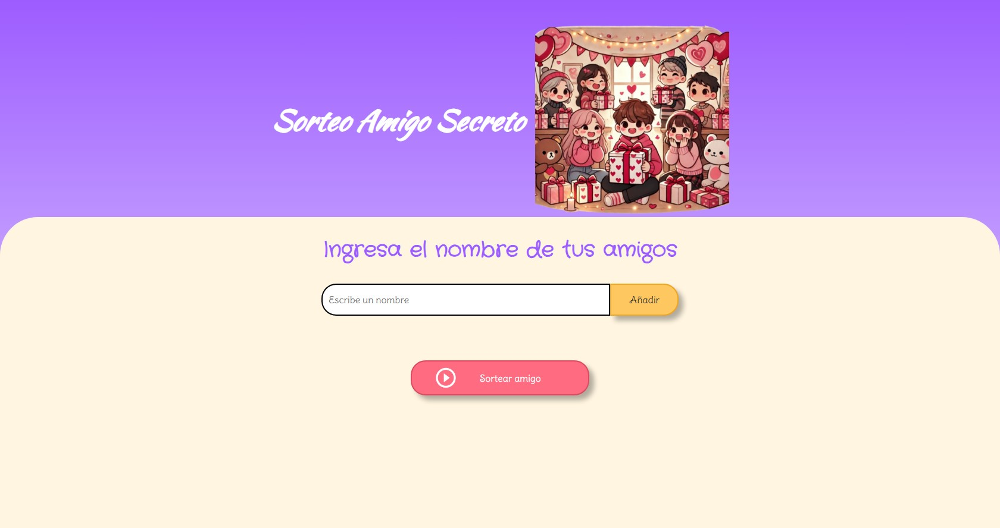
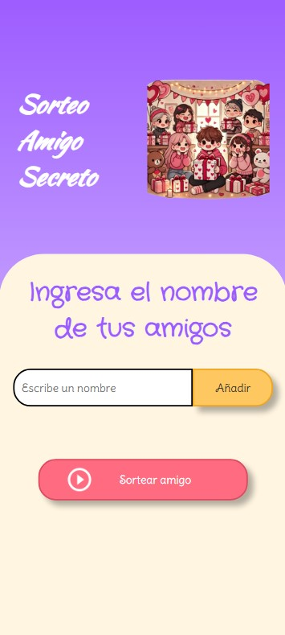
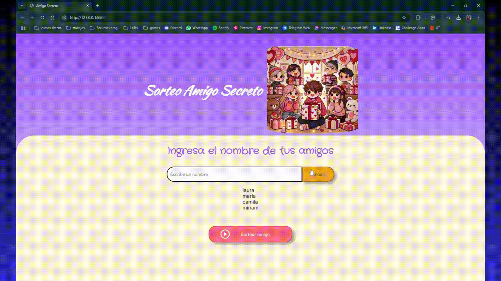
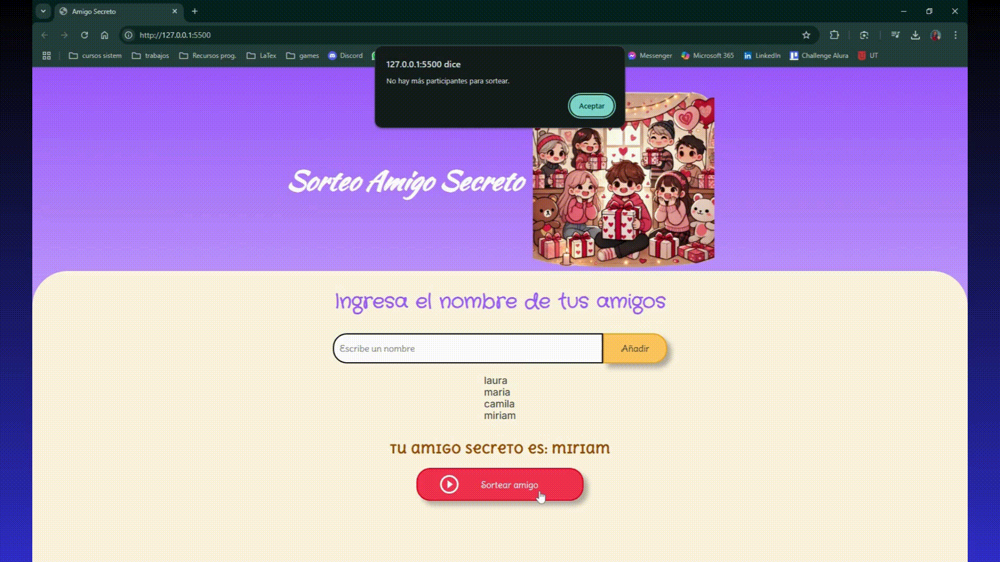

# 💌Sorteo de Amigo Secreto💝   
¿Quieres hacer un sorteo para jugar en San Valentín / Amor y amistad, pero las personas salen repetidas o se sacan a sí mismas? Este proyecto es la solución perfecta

## 💕 Visualización      
💻**Computadora**💫
   
📱**Telefono Movil**💫

  

## 💖 Características  
✔ Validación de nombres para evitar vacíos o caracteres no permitidos.    
Campo vacío o entradas cómo números y/o caracteres especiales son tomados como error y no se añaden a la lista, también se verifica que la lista contenga información antes de realizar el sorteo.
    
✔ No distingue entre mayusculas y minusculas.    
Valida que los nombres no se repitan aunque se hayan escrito de manera diferente (ejem: Paula / paula)
    
✔ Verifica que haya una cantidad de participantes mínima para realizar el sorteo.    
Si estás tú solo o sólo 2 personas no tendría caso hacer el sorteo, ¿Verdad?
    
✔ Añadir los nombres.    
Aún si son sólo 3 personas o para grupos grandes, permite añadir los nombres uno a uno y los ubica en una lista visible.
    
✔ No vas a sacarte a ti mismo.    
Para evitar esto la página te pregunta si este es tu nombre y hace un nuevo sorteo en ese caso.
    
✔ Puedes sortear varios grupos.    
Una vez que todos los nombres en la lista actual han sido sorteados, un botón nuevo se hace presente para dar la opción de volver todo de cero y hacer un nuevo sorteo con una lista diferente.
    